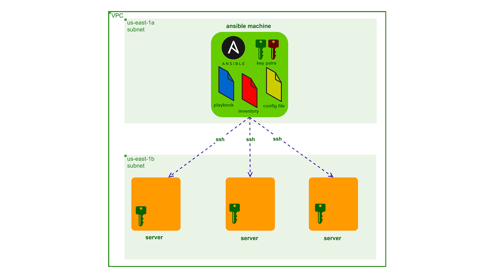

# Ansible AWS EC2 Web App Deployment
This project demonstrates how to automate the deployment of a web application on AWS EC2 instances using Ansible. The setup includes the creation of a secure Ansible machine and multiple servers to host the application.

# Architecture Overview


The architecture consists of:

- **Ansible Machine:** Controls the deployment process, contains Ansible playbooks, inventory, and configuration files.
- **Servers:** EC2 instances where the web application is deployed.
# Project Components
# 1. Security Groups (SG)
- **Ansible Machine SG:**
   - Allows SSH access from your IP address.
- **Server SG:**
   - Allows SSH access from the Ansible SG.
   - Allows HTTP access on port 80.
# 2. Ansible Machine Setup
- **Launch Ansible Machine:**
     - AMI: Amazon Linux 2
     - Security Group: Ansible Machine SG
- **Create SSH Key Pairs:**
    - Generate RSA key pair: `ssh-keygen -t rsa -b 2048`
    - Import the public key to AWS EC2 console as `ansible-pub-key`.
# 3. Server Setup
- **Launch EC2 Instances:**
   - **Key Pair:** `ansible-pub-key`
   - **Security Group:** Server SG
- **Test SSH Connection:**
  - Connect to servers via private IP using the generated key.
# 4. Install Ansible
- **Install Ansible on the Ansible Machine:**
```
bash
copy code
sudo yum update -y
sudo amazon-linux-extras install ansible2 -y
```
# 5. Ansible Configuration
  - **Inventory File:** Lists all the servers.
  - **Playbook:** Automates the deployment process.
  - **Ansible Configuration:**
     - `ansible.cfg` file for default settings:
```
ini
Copy code
[defaults]
remote_user = ec2-user 
inventory = inventory 
private_key_file = ~/.ssh/id_rsa
```
# 6. Deployment
 - **Test Connectivity:**
```
bash
Copy code
ansible all --key-file ~/.ssh/id_rsa -i inventory -m ping -u ec2-user
```
 - **Run the Playbook:**
```
bash
Copy code
ansible-playbook deploy-techmax.yml
```
# 7. Playbook Details
  - **Playbook:** deploy-techmax.yml
     - Update EC2 instances.
     - Install Apache server.
     - Download web files from GitHub.
     - Unzip and deploy the website files.
     - Start the Apache server.
# Repository Contents
  - **Reference Architecture:** `Reference Architecture.jpg`
  - **Ansible Playbook:** `deploy-techmax.yml`
  - **Inventory File:** Lists the target EC2 instances.
  - **Ansible Configuration:** `ansible.cfg`
# Conclusion
This project automates the deployment of a web application on AWS EC2 using Ansible, ensuring a streamlined and repeatable deployment process.


